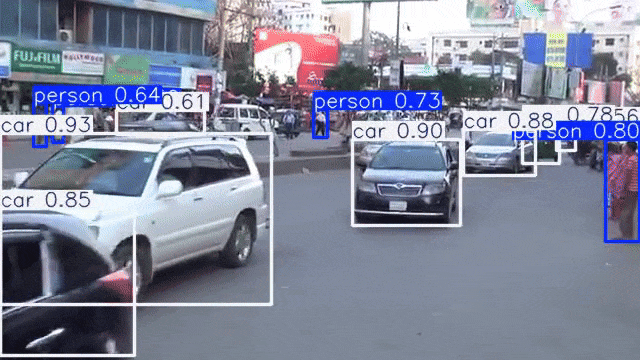

# 🚦 Traffic Object Detection in Dhaka using YOLOv8

This project focuses on applying computer vision techniques to analyze **traffic video feed data from Dhaka, Bangladesh**.
The goal is to detect and label objects such as vehicles and pedestrians in real-time using **YOLOv8**, a state-of-the-art object detection model.

This work was completed as part of the **WorldQuant University Data Science Work Simulation**, building upon skills in image analysis, deep learning, and model optimization.



<p>
  
</p>
<p>
  
</p>
<p>
  
</p>
<p>
  
</p>


---

## 📁 Repository Structure

```
Notebooks/
├── 321-traffic-data-as-images-and-video.ipynb
├── 322-traffic-data-as-images-and-video.ipynb
├── 33-object-detection-with-yolov8.ipynb
├── 34-custom-objects-with-yolov8.ipynb
├── 35-dataset-augmentation.ipynb
└── 7-assignment.ipynb
```

Each notebook builds on the previous one, gradually introducing data processing, model training, and performance optimization.

---

## 🎯 Project Objectives

1. **Explore traffic image and video datasets**

   * Work with XML annotations containing bounding box information.
   * Extract and process video frames for object detection tasks.

2. **Implement YOLOv8 for Object Detection**

   * Detect objects such as vehicles and people using a pre-trained YOLOv8 model.
   * Parse model output and visualize bounding boxes on images and video streams.

3. **Train a Custom YOLOv8 Model**

   * Convert and adapt XML bounding boxes to YOLO format.
   * Fine-tune the YOLOv8 model to detect new custom object classes.
   * Organize the dataset into YOLO’s directory structure.

4. **Apply Data Augmentation Techniques**

   * Use Torchvision transforms to simulate diverse conditions.
   * Understand how YOLO applies augmentations during training.
   * Improve model generalization and robustness.

5. **Optimize Model Training and Evaluation**

   * Handle malformed or missing data gracefully.
   * Assess detection accuracy and loss curves.
   * Identify and address overfitting through regularization and augmentation.

---

## 🧠 Key Concepts & New Terms

* **Bounding Boxes** – Rectangular regions defining object positions in images.
* **YOLO (You Only Look Once)** – Real-time object detection algorithm.
* **Transfer Learning** – Adapting pre-trained models to new tasks.
* **XML Annotations** – Labeling format for bounding boxes and class metadata.
* **Data Augmentation** – Expanding training data through transformations.
* **YAML Configuration** – Format used by YOLO to define dataset paths and labels.

---

## 🧩 Tools and Frameworks

* **Python 3**
* **OpenCV** – For video and image processing
* **PyTorch** – For deep learning operations
* **Ultralytics YOLOv8** – For pre-trained and custom object detection models
* **Torchvision** – For image transformations and augmentation
* **Matplotlib / Seaborn** – For visualization and analysis

---

## ⚙️ Methodology Overview

1. **Data Preparation**

   * Extracted frames from video feeds.
   * Parsed and visualized XML annotations.
   * Split data into training, validation, and test sets.

2. **Model Training**

   * Used a **pre-trained YOLOv8 model** for baseline detection.
   * Fine-tuned YOLOv8 on the **Dhaka Traffic dataset** for custom vehicle classes.
   * Applied **transfer learning** to leverage prior knowledge efficiently.

3. **Evaluation and Optimization**

   * Visualized detections on unseen data.
   * Implemented **data augmentation** and **error handling**.
   * Compared results across models and parameters.

---

## 📊 Results and Insights

* The fine-tuned YOLOv8 model successfully detected vehicles and pedestrians with high accuracy.
* Custom training significantly improved performance on local traffic classes not covered by the base model.
* Data augmentation improved generalization and reduced overfitting.
* Efficient pipeline for converting and visualizing bounding boxes was developed.

---

## 🌍 Ethical and Sustainability Note

**The following are fragments from the article “The self-driving trolley problem: how will future AI systems make the most ethical choices for all of us?” published on The Conversation, November 23, 2021** 

**##The self-driving trolley problem: how will future AI systems make the most ethical choices for all of us?**

Artificial intelligence (AI) is already making decisions in the fields of business, health care and manufacturing. But AI algorithms generally still get help from people applying checks and making the final call. What would happen if AI systems had to make independent decisions, and ones that could mean life or death for humans?

Unlike humans, robots lack a moral conscience and follow the “ethics” programmed into them. At the same time, human morality is highly variable. The “right” thing to do in any situation will depend on who you ask.

For machines to help us to their full potential, we need to make sure they behave ethically. So the question becomes: how do the ethics of AI developers and engineers influence the decisions made by AI?

What if a car’s computer could evaluate the relative “value” of the passenger in its car and of the pedestrian? If its decision considered this value, technically it would just be making a cost-benefit analysis.

This may sound alarming, but there are already technologies being developed that could allow for this to happen. For instance, the recently re-branded Meta (formerly Facebook) has highly evolved facial recognition that can easily identify individuals in a scene.

If these data were incorporated into an autonomous vehicle’s AI system, the algorithm could place a dollar value on each life. This possibility is depicted in an extensive 2018 study conducted by experts at the Massachusetts Institute of Technology and colleagues.

Through the Moral Machine experiment, researchers posed various self-driving car scenarios that compelled participants to decide whether to kill a homeless pedestrian or an executive pedestrian.

Results revealed participants’ choices depended on the level of economic inequality in their country, wherein more economic inequality meant they were more likely to sacrifice the homeless man.

Examples of failures and bias in technology implementation have included racist soap dispenser and inappropriate automatic image labeling.

AI is not “good” or “evil”. The effects it has on people will depend on the ethics of its developers. So to make the most of it, we’ll need to reach a consensus on what we consider “ethical”.

While private companies, public organisations and research institutions have their own guidelines for ethical AI, the United Nations has recommended developing what they call “a comprehensive global standard-setting instrument” to provide a global ethical AI framework – and ensure human rights are protected.”

References
Abu-Khalaf, Jumana, and Paul Haskell-Dowland. “The Self-driving Trolley Problem: How Will Future AI Systems Make the Most Ethical Choices for All of Us?” [**The Conversation**](theconversation.com/the-self-driving-trolley-problem-how-will-future-ai-systems-make-the-most-ethical-choices-for-all-of-us-170961).

---

## 🧾 References

* Hasselbalch, G. (2022). *Data Pollution & Power – White Paper for a Global Sustainable Agenda on AI*.
  The Sustainable AI Lab, Bonn University.
* Ultralytics YOLOv8 Documentation: [https://docs.ultralytics.com](https://docs.ultralytics.com)
* WorldQuant University – Applied Data Science Lab

---

## 👤 Author

**Houssam Kichchou**
🌐 [GitHub: Houssam-123-ship-it](https://github.com/Houssam-123-ship-it)
🎓 WQU Data Science Work Simulation — Computer Vision Track

---

Would you like me to also add a **short project summary paragraph** at the top (like a professional “About this project” description for your GitHub repo page)?
That can help make it more appealing when people first open your repository.
